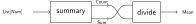
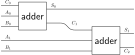
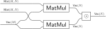

.. _index:

yarrow
==================================

Yarrow is a library for representing large
`string diagrams <https://en.wikipedia.org/wiki/String_diagram>`_:
networks of
operations with multiple inputs and outputs.
Here's a simple string diagram with two operations, ``summary`` and ``divide``.

.. _mean_diagram:

   A diagram representing a simple program for computing the mean
   of a list of numbers.

Yarrow represents string diagrams using the Diagram datastructure (see :ref:`yarrow.diagram`).
This datastructure can also be thought of as a kind of *hypergraph* - see
:ref:`theory` for more information.

.. warning::

   Yarrow is still in early development.
   The API is not stable, and several features are not yet implemented.
   See the :ref:`roadmap` for more information.

What yarrow is not
------------------

Yarrow is *not* a library for graph layout.
A :ref:`yarrow.diagram` is not a picture; it is analogous to a *graph* or
*tree*.

What yarrow is for
------------------

You can think of a :ref:`yarrow.diagram` as generalising syntax *trees* to
syntax *graphs*.
This is most useful when the primitive operations in an expression can have
multiple outputs.
Here are two examples.

Below is an *electronic circuit* implementing a 2-bit adder.
It's built from two 1-bit
`full-adders <https://en.wikipedia.org/wiki/Adder_(electronics)#Full_adder>`_
which both have two outputs: a *sum* and *carry* bit.

   A 2-bit adder pictured as a string diagram

Another example is *neural network architectures*.
Below is a `bilinear layer <https://arxiv.org/abs/2305.03452>`_ pictured as a
string diagram.

   A neural network bilinear layer pictured as a string diagram

In both of these cases, the diagrams are *completely formal mathematical objects*.
Specifically, a diagram is an *arrows* in a *category* (see :ref:`theory`).
Examples of categories for circuits and neural networks are described in
:cite:p:`full-abstraction` and :cite:p:`polycirc`,
but **you can use Yarrow without worrying about category theory at all**.

Why yarrow instead of a directed graph?
^^^^^^^^^^^^^^^^^^^^^^^^^^^^^^^^^^^^^^^

A :ref:`yarrow.diagram` does extra bookkeeping that directed graphs do not.
Try to represent the program in :numref:`mean_diagram` as a DAG whose nodes
represent operations:

Information has been lost:

1. Multiple edges between operations
2. Which inputs connect to which outputs (only "dependency" structure remains)
3. The "dangling wires" representing inputs/outputs to the whole diagram

:ref:`yarrow.diagram` keeps track of all of this information.

The Mathematics of Yarrow
-------------------------

The :ref:`yarrow.diagram` datastructure has a formal mathematical
interpretation.
Each Diagram is an *arrow of the free symmetric monoidal category presented by a
given signature*.
For a complete explanation, see the paper :cite:p:`dpafsd`
and the :ref:`theory` section.

.. toctree::
   :maxdepth: 2
   :caption: Contents:

   usage
   theory
   backends
   roadmap
   api_reference

Bibliography
============

.. bibliography::
   :all:
